```mermaid
gantt
dateFormat HH:mm
axisFormat %H:%M
Section Tagesziele 
Kein P/F/K: 00:00, 24:00
Section Tageslauf
```

# 1-1-3-1-3-4-3-2-4

# Zielbericht

## Zusammenfassung Des Zeitraums

Der erste geplante Tag. Letztlich wurden wenig geplante Ziele erreicht, es war aber der erste Kontakt mit Struktur in Aktion, weitere Interaktion nötig um Ecken gerade zu bügeln (auch wenn die grundsätzliche Struktur jetzt schon ziemlich glatt ist, in bestimmetn Fällen kann sie aber noch mehr Interaktivität gebrauchen)

## Positives

- Sport wieder angefangen
- Grundsätzliche Tagesstruktur gefolgt
- Zimmer neu gestaltet, Optimierung zu Sauberkeit, Nutzerfreundlichkeit und Ästhetik hin

## Negatives

- Praktisch keine gesetzten Ziele verfolgt oder erreicht

## Anpassung

## Metadaten

Geplante Ziele:  
Erreichte Ziele:

# Ziele

- [ ] Kein P/F/K: 00:00, 24:00
- [ ] Alle Mahlzeiten eingetragen: 00:00, 24:00
- [ ] Mehr als 02:00

# Indikatoren

Schlafqualität ('Core, Nap1, Nap2'):  
Nährstoffeinnahme ('Zeitpunkt Anfang, Zeitpunkt Ende, Kalorieneinnahme, Kohlenhydrate, Protein, Fett'):  
Wassereinnahme:('Wert')

# Tageslauf

## 00:00 - 03:00

Geschlafen (Zielteil): 00:00, 03:00

## 03:00

### Ziele

- [ ] Aufgestanden, 0,5L getrunken , angezogen: 03:00, 03:10
- [ ] Gegessen, Zähne geputzt: 03:10, 03:20
- [ ] Meditiert: 03:20, 03:30

### Indikatoren

Schlafqualität Core (Indikatorteil, 'Wert'): 6  
Gewicht ('Wert'):  
Stimmung ('Wert'): 4  
Nährstoffeinnahme (Indikatorteil' Kalorieneinnahme, Kohlenhydrate, Protein, Fett'):

## 03:30

### Ziele

- [ ] 5 Seiten Staatsorga Lehrbuch: Halbstunde

### Indikatoren

Stimmung ('Wert'):

## 04:00

### Ziele

- [ ] 5 Seiten Staatsorga Lehrbuch: Halbstunde

### Indikatoren

Stimmung ('Wert'):

## 04:30

### Ziele

- [ ] 5 Seiten Staatsorga Lehrbuch: Halbstunde

### Indikatoren

Stimmung ('Wert'):

## 05:00

### Ziele

- [ ] 5 Seiten Staatsorga Lehrbuch: Halbstunde

### Indikatoren

Stimmung ('Wert'):

## 05:30

### Ziele

- [ ] 5 Seiten Staatsorga Lehrbuch: Halbstunde

### Indikatoren

Stimmung ('Wert'):

## 06:00

### Ziele

- [ ] 5 Seiten Staatsorga Lehrbuch: Halbstunde

### Indikatoren

Stimmung ('Wert'): 5

## 06:30

### Ziele

- [ ] 5 Seiten Staatsorga Lehrbuch: Halbstunde

### Indikatoren

Stimmung ('Wert'): 5

## 07:00

### Ziele

- [ ] Geschlafen (Zielteil): 07:00, 07:30

### Indikatoren

Stimmung ('Wert'):

## 07:30

### Ziele

- [ ] Geschlafen (Zielteil): 07:30, 08:00

### Indikatoren

Schlafqualität Nap 1(Indikatorteil, 'Wert'):  
Stimmung ('Wert'):

## 08:00

### Ziele

- [ ] Reiskocher gestartet: 08:00
- [ ] Gegessen und Zähne geputzt: 08:10, 08:15
- [ ] Zur Uni gefahren: 08:15, 08:30

### Indikatoren

Stimmung ('Wert'):

## 08:30

### Ziele

- [ ] E-Mails gecheckt: 08:30, 08:35

### Indikatoren

Stimmung ('Wert'):

## 09:00

### Ziele

- [ ] 1 PÜ Fall BGB-AT (Zielteil): Halbstunde

### Indikatoren

Stimmung ('Wert'):

## 09:30

### Ziele

- [ ] 1 PÜ Fall BGB-AT (Zielteil): Halbstunde

### Indikatoren

Stimmung ('Wert'): 5

## 10:00

### Ziele

- [ ] 1 PÜ Fall BGB-AT (Zielteil): Halbstunde

### Indikatoren

Stimmung ('Wert'): 6

## 10:30

### Ziele

- [x] 1 PÜ Fall Staatsorga (Zielteil): Halbstunde

### Indikatoren

Stimmung ('Wert'): 6

## 11:00

### Ziele

- [ ] 1 PÜ Fall Staatsorga (Zielteil): Halbstunde

### Indikatoren

Stimmung ('Wert'): 4

## 11:30

### Ziele

- [ ] 1 PÜ Fall Staatsorga (Zielteil): Halbstunde

### Indikatoren

Stimmung ('Wert'): 5

## 12:00

### Ziele

- [ ] anki new/due abgearbeitet (Zielteil): Halbstunde

### Indikatoren

Stimmung ('Wert'):

## 12:30

### Ziele

- [ ] anki new/due abgearbeitet (Zielteil): Halbstunden

### Indikatoren

Stimmung ('Wert'):

## 13:00

### Ziele

- [x] Nach hause gefahren: 13:00, 13:15
- [x] Gegessen: 13:25, 13:35
- [x] Geschlafen (Zielteil): 13:25, 13:30

### Indikatoren

Stimmung ('Wert'): 5

## 13:30

### Ziele

- [x] Geschlafen (Zielteil): 13:30, 13:45
- [ ] Zur Uni gefahren: 13:45, 14:00

### Indikatoren

Schlafqualität Nap 2 (Indikatorteil, 'Wert'): 7  
Stimmung ('Wert'): 6

## 14:00

### Ziele

- [ ] 1 PÜ Fall Staatsorga (Zielteil): Halbstunde

### Indikatoren

Stimmung ('Wert'):

## 14:30

### Ziele

1 PÜ Fall Staatsorga (Zielteil): Halbstunde

### Indikatoren

Stimmung ('Wert'):

## 15:00

### Ziele

1 PÜ Fall Staatsorga (Zielteil): Halbstunde

### Indikatoren

Stimmung ('Wert'):

## 15:30

### Ziele

1 PÜ Fall BGB-AT (Zielteil): Halbstunde

### Indikatoren

Stimmung ('Wert'):

## 16:00

### Ziele

1 PÜ Fall BGB-AT (Zielteil): Halbstunde

### Indikatoren

Stimmung ('Wert'):

## 16:30

### Ziele

1 PÜ Fall BGB-AT (Zielteil): Halbstunde

### Indikatoren

Stimmung ('Wert'):

## 17:00

### Ziele

Anki new eintragen (Zielteil): Halbstunde

### Indikatoren

Stimmung ('Wert'):

## 17:30

### Ziele

Anki new eintragen (Zielteil): Halbstunde

### Indikatoren

Stimmung ('Wert'):

## 18:00

### Ziele

- [ ] Nach hause gefahren: 18:00, 18:15

### Indikatoren

Stimmung ('Wert'):

## 18:30

### Ziele

- [ ] Fleisch gekocht: 18:30, 19:00
- [ ] Sport gemacht (Process, Zielteil): 18:30, 19:00

### Indikatoren

Stimmung ('Wert'):

## 19:00

### Ziele

- [ ] Sport gemacht (Process, Zielteil): 19:00, 19:30

### Indikatoren

Stimmung ('Wert'):

## 19:30

### Ziele

- [ ] Geduscht: 19:30, 19:35
- [ ] Gegessen, Zähne geputzt: 19:35, 19:45

### Indikatoren

Stimmung ('Wert'):

## 20:00

### Ziele

An Ziel gearbeitet (Zielteil): Halbstunde

### Indikatoren

Stimmung ('Wert'):

## 20:30

### Ziele

An Ziel gearbeitet (Zielteil): Halbstunde

### Indikatoren

Stimmung ('Wert'):

## 21:00

### Ziele

- [ ] Tagesbericht fertig (Process): 21:00, 21:15
- [ ] Tageszielsetzung fertig (Process): 21:15, 21:30

### Indikatoren

Stimmung ('Wert'):

## 21:30

### Ziele

- [ ] Geputzt (Process): 21:30, 21:45
- [ ] Vorbereitung für nächsten Tag fertig (Process): 21:45, 22:00

### Indikatoren

Stimmung ('Wert'):

## 22:00 - 24:00

Geschlafen (Zielteil): 22:00, 24:00
