---

id:: 1bf9426f-54c6-42a6-9259-27d6fd840868
type:: zeitraumziele
dateStart:: 2022-12-09
dateEnd:: 2022-12-09
aliases:
---

```mermaid
gantt
dateFormat HH:mm
axisFormat %H:%M
Section Tagesziele 
Kein P/F/K: 00:00, 24:00
Section Tageslauf
```

# 1-1-3-1-3-4-3-2-5

## Zusammenfassung Des Zeitraums

Der zweite Tag unter Struktur, die Zielsetzung war wieder nur kurz, schlampig und wenig durchdacht. Morgens bin ich ihr halbwegs gut gefolgt, obwohl ich Schlupflöcher im System genutzt habe (Ungenauigkeiten) und generell eine schwache Schaffensbzw. Denkmoral gezeigt habe.

## Positives

- Grundsätzlich in der Struktur gewesen

## Negatives

- Wieder weniger Jura geschafft, als geplant

## Anpassung

- Nap 1 auf 20 min reduziert
- Essen auf vor Training verschoben

## Metadaten

Geplante Ziele:  
Erreichte Ziele:

# Ziele

- [ ] Kein P/F/K: 00:00, 24:00
- [ ] Alle Mahlzeiten eingetragen: 00:00, 24:00
- [ ] Mehr als 2 Liter Wasser getrunken
- [ ] Anki due abgearbeitet

# Indikatoren

Schlafqualität ('Core, Nap1, Nap2'):  
Nährstoffeinnahme ('Zeitpunkt Anfang, Zeitpunkt Ende, Kalorieneinnahme, Kohlenhydrate, Protein, Fett'):  
Wassereinnahme ('Wert'):

# Tageslauf

## 00:00 - 03:00

- [x] Geschlafen (Zielteil): 00:00, 03:00

## 03:00

### Ziele

- [x] Aufgestanden, gewogen, 0,5 L getrunken, angezogen: 03:00, 03:10
- [ ] Gegessen, Zähne geputzt, rasiert: 03:10, 03:20
- [ ] Meditiert: 03:20, 03:30

### Indikatoren

Schlafqualität Core (Indikatorteil, 'Wert'): 6  
Gewicht ('Wert'): 70,8  
Stimmung ('Wert'): 6  
Nährstoffeinnahme (Indikatorteil' Kalorieneinnahme, Kohlenhydrate, Protein, Fett'):

## 03:30

### Ziele

- [ ] Informationen BGB PÜ 1 herausschreiben: Halbstunde

### Indikatoren

Stimmung ('Wert'): 6

## 04:00

### Ziele

- [ ] Informationen BGB PÜ 2 herausschreiben: Halbstunde

### Indikatoren

Stimmung ('Wert'): 6

## 04:30

### Ziele

- [x] Informationen BGB PÜ 3 herausschreiben: Halbstunde

### Indikatoren

Stimmung ('Wert'): 5

## 05:00

### Ziele

- [x] Informationen Staatsorga PÜ 1 herausschreiben: Halbstunde

### Indikatoren

Stimmung ('Wert'): 6

## 05:30

### Ziele

- [x] Informationen Staatsorga PÜ 2 herausschreiben: Halbstunde

### Indikatoren

Stimmung ('Wert'): 6

## 06:00

### Ziele

- [ ] Informationen Staatsorga PÜ 3 herausschreiben: Halbstunde

### Indikatoren

Stimmung ('Wert'): 5

## 06:30

### Ziele

- [ ] Anki due abgearbeitet: Halbstunde

### Indikatoren

Stimmung ('Wert'):

## 07:00

### Ziele

- [ ] Geschlafen (Zielteil): 07:00, 07:30

### Indikatoren

## 07:30

### Ziele

- [x] Geschlafen (Zielteil): 07:30, 08:00

### Indikatoren

Schlafqualität Nap 1(Indikatorteil, 'Wert'): 3

## 08:00

### Ziele

- [ ] Reiskocher gestartet: 08:00
- [ ] Gegessen und Zähne geputzt: 08:10, 08:15
- [ ] Zur Uni gefahren: 08:15, 08:30

### Indikatoren

Stimmung ('Wert'):

## 08:30

### Ziele

- [ ] E-Mails gecheckt und geantwortet (process): 08:30, 08:45
	- [ ] Mami geschrieben

### Indikatoren

Stimmung ('Wert'):

## 09:00

### Ziele

1 PÜ Fall BGB-AT (Zielteil): Halbstunde

### Indikatoren

Stimmung ('Wert'):

## 09:30

### Ziele

1 PÜ Fall BGB-AT (Zielteil): Halbstunde

### Indikatoren

Stimmung ('Wert'): 4

## 10:00

### Ziele

- [ ] 1 PÜ Fall BGB-AT (Zielteil): Halbstunde

### Indikatoren

Stimmung ('Wert'): 5

## 10:30

### Ziele

- [ ] 1 PÜ Fall Staatsorga (Zielteil): Halbstunde

### Indikatoren

Stimmung ('Wert'): 7

## 11:00

### Ziele

- [ ] 1 PÜ Fall Staatsorga (Zielteil): Halbstunde

### Indikatoren

Stimmung ('Wert'): 5

## 11:30

### Ziele

- [ ] 1 PÜ Fall Staatsorga (Zielteil): Halbstunde

### Indikatoren

Stimmung ('Wert'): 6

## 12:00

### Ziele

- [ ] Fields fertigstellen: Halbstunde

### Indikatoren

Stimmung ('Wert'): 5

## 12:30

### Ziele

- [ ] Grundrahmen Verweisung Ziele (auch relevant für Kommentare, Termine etc., die natürlich auch in Zielform bestehen) auf zukünftige Zeiträume erstellen: Halbstunde

### Indikatoren

Stimmung ('Wert'): 5

## 13:00

### Ziele

- [ ] Nach hause gefahren: 13:00, 13:15
- [ ] iPad mit nach oben genommen: 13:15
- [ ] Gegessen: 13:25, 13:35
- [ ] Geschlafen (Zielteil): 13:25, 13:30

### Indikatoren

Stimmung ('Wert'):

## 13:30

### Ziele

- [ ] Geschlafen (Zielteil): 13:30, 13:45
- [ ] iPad mit nach unten genommen: 13:45
- [ ] Zur Uni gefahren: 13:45, 14:00

### Indikatoren

Schlafqualität Nap 2 (Indikatorteil, 'Wert'):  
Stimmung ('Wert'):

## 14:00

### Ziele

- [ ] 1 PÜ Fall Staatsorga (Zielteil): Halbstunde

### Indikatoren

Stimmung ('Wert'):

## 14:30

### Ziele

- [ ] 1 PÜ Fall Staatsorga (Zielteil): Halbstunde

### Indikatoren

Stimmung ('Wert'):

## 15:00

### Ziele

- [ ] 1 PÜ Fall Staatsorga (Zielteil): Halbstunde

### Indikatoren

Stimmung ('Wert'): 4

## 15:30

### Ziele

- [ ] 1 PÜ Fall BGB-AT (Zielteil): Halbstunde

### Indikatoren

Stimmung ('Wert'): 4

## 16:00

### Ziele

- [ ] 1 PÜ Fall BGB-AT (Zielteil): Halbstunde

### Indikatoren

Stimmung ('Wert'):

## 16:30

### Ziele

- [ ] 1 PÜ Fall BGB-AT (Zielteil): Halbstunde

### Indikatoren

Stimmung ('Wert'):

## 17:00

### Ziele

Struktur Projects fertigstellen: Halbstunde

### Indikatoren

Stimmung ('Wert'):

## 17:30

### Ziele

### Indikatoren

Stimmung ('Wert'):

## 18:00

### Ziele

- [ ] Nach hause gefahren: 18:00, 18:15

### Indikatoren

Stimmung ('Wert'):

## 18:30

### Ziele

- [ ] Fleisch gekocht: 18:30, 19:00
- [ ] Sport gemacht (Process, Zielteil): 18:30, 19:00

### Indikatoren

Stimmung ('Wert'):

## 19:00

### Ziele

- [ ] Sport gemacht (Process, Zielteil): 19:00, 19:30

### Indikatoren

Stimmung ('Wert'):

## 19:30

### Ziele

- [ ] Geduscht: 19:30, 19:35
- [ ] Gegessen, Zähne geputzt: 19:35, 19:45
- [ ] Kleidung eingeräumt: 19:45, 20:00

### Indikatoren

Stimmung ('Wert'):

## 20:00

### Ziele

- [ ] Process Tagesbericht/Tageszielsetzung Schritt für Schritt durchdenken und in einem Dokument erfassen, mit Zeitangaben: Halbstunde

### Indikatoren

Stimmung ('Wert'):

## 20:30

### Ziele

- [ ] Tagesbericht simulieren und Probleme herausschreiben: Halbstunde

### Indikatoren

Stimmung ('Wert'):

## 21:00

### Ziele

Anpassung des Process Tagesbericht auf Basis der Simulation: Halbstunde

### Indikatoren

Stimmung ('Wert'):

## 21:30

### Ziele

- [ ] Tagesbericht fertig (Process): 21:30, 21:45
- [ ] Tageszielsetzung fertig (Process): 21:45, 22:00

### Indikatoren

Stimmung ('Wert'):

## 22:00

### Ziele

- [ ] Geputzt (Process): 22:00, 22:15
- [ ] Vorbereitung für nächsten Tag fertig (Process): 22:15, 22:30

### Indikatoren

Stimmung ('Wert'):

## 22:30 - 24:00

Geschlafen (Zielteil): 22:30, 24:00
