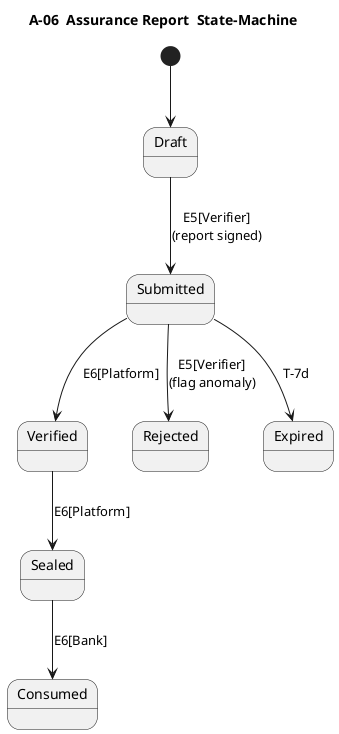

### 3 Artifact Catalogue  
*(Ontological inventory of every object that crosses a trust-boundary)  

| UID | Artifact | Owner-of-Record | Description (Functional Payload) | Canonical Form | PII / Sensitivity | Immutable Sections |
|-----|----------|-----------------|----------------------------------|----------------|-------------------|--------------------|
| **A-01** | **Loan-Intent Sheet** | SME | Minimal declaration: borrower ID, desired amount, tenor, project synopsis, preferred vendor shortlist | JSON doc (platform schema v1.x) | Medium | Entire document after E1 timestamp |
| **A-02** | **Vendor Proposal** | Vendor | Scope, technical specifications, cost, expected CO₂-e reduction, implementation schedule | PDF w/ cryptographic hash & SHA-256 metadata block | Low | Line-item costs; CO₂-e estimate |
| **A-03** | **KYC/AML Packet** | SME | Corporate registration, beneficial ownership, bank statements | Encrypted ZIP (ISO 27001) | **High** | All files |
| **A-04** | **Green-Taxonomy Eligibility Checklist** | Platform | Auto-populated YES/NO matrix against regulator taxonomy | Markdown table auto-generated | Medium | Checklist answers |
| **A-05** | **Verification Plan** | External Verifier | Audit itinerary, sample size, instrumentation to be used | PDF | Low | Audit itinerary |
| **A-06** | **Assurance Report** | External Verifier | Findings: baseline validation, projected impact confirmation, anomaly flags | PDF w/ verifier e-signature | Medium | Findings section |
| **A-07** | **Dossier Manifest** | Platform | Merkle-tree manifest enumerating hashes of A-01 … A-06 | JSON + root hash | None | Entire JSON |
| **A-08** | **Credit Decision Sheet** | Bank | Internal risk grade, green score, conditionality clauses | XML (internal bank schema) exported as PDF | **High** | Risk grade node |
| **A-09** | **Term Sheet** | Bank | Final offer terms, covenants, disbursement milestones | Human-readable PDF + machine-readable JSON | High | Commercial terms section |
| **A-10** | **Disbursement Instruction** | Bank | SWIFT/BIC payment instruction referencing A-09 | ISO 20022 XML | Medium | Amount + account |
| **A-11** | **Impact Report (Periodic)** | SME (verified) | Actual energy/CO₂ metrics vs baseline, variance explanation | CSV + signed PDF summary | Medium | CO₂-e figures |
| **A-12** | **Subsidy / Guarantee Certificate** | Regulator | Confirmation of incentive payout eligibility, amount, schedule | PDF w/ QR signature | Medium | Certificate ID |
| **A-13** | **Event Audit Log** | Platform | Append-only ledger of event codes (E0-E9) with timestamps and actor signature | JSONL stored in immutable bucket | None | Entire file |

> **Minimalism rule:** If an artefact is not on this table it does **not** exist in production; scope-creep requires explicit UID registration and cross-reference.

---

### 4 Designing Artifact State-Machine Diagrams  
*(Turn inert documents into controlled, audit-proof lifecycles)*  

#### 4.1 Universal Principles  

1. **Single Source of Truth** – Exactly one state machine per UID; duplicate logic breeds divergence.  
2. **Finite & Exhaustive** – States form a closed set; every event must lead to a defined successor or an *ERROR* sink.  
3. **Trigger-Bound Transitions** – Each arrow is labelled with the **Event Code** (E0-E9) that provokes it—never prose.  
4. **Role-Guarded** – Transition labels append the authorised actor in brackets `E5[Verifier]`; statically enforce RBAC.  
5. **Timeout Paths** – For critical flows introduce `T-Δ` dashed transitions to *Expired* or *Escalated* states.  
6. **Immutability Checkpoints** – Use a double-border state to denote cryptographic sealing (e.g., Dossier Manifest sealed after *Sealed* state).  
7. **Diagram-as-Code** – Prefer PlantUML or Mermaid committed to Git; GUIs must export the underlying markup.  

#### 4.2 Canonical State Vocabulary  

| Label | Semantics |
|-------|-----------|
| **Draft** | Actor may edit freely; checksum mutable |
| **Submitted** | Actor finalised; waiting for downstream review |
| **In-Review** | Designated reviewer examining; locked for edits |
| **Verified** | External Verifier attests integrity/accuracy |
| **Rejected** | Reviewer or Verifier fatally rejects; must fork new *Draft* |
| **Sealed** | Manifest hash generated; content immutable |
| **Consumed** | Downstream system (e.g., Bank) has ingested; no further platform edits |
| **Archived** | Lifecycle closed, retained for audit retention period |

> **Rule:** *Draft → Submitted* always triggered by the artifact’s owner; *Verified* can only be reached via **E5[Verifier]**.

#### 4.3 Illustrative Fragment (PlantUML) – Assurance Report (A-06)

*Copy template; replace states/events as required.*

#### 4.4 Workflow to Produce Diagrams  

1. **Extract States**  
   *Read artifact definition → enumerate logically distinct phases.*  
2. **Map Event Codes**  
   *For each state pair, ask “what event legitimately moves it?” – use Trigger Ledger.*  
3. **Assign Authorised Actor**  
   *Overlay RBAC; annotate transition labels.*  
4. **Insert Timeout Guards**  
   *Consult Governance Table for SLA; add `T-Δ` paths.*  
5. **Cryptographic Checkpoints**  
   *If integrity sealing required, add *Sealed* state with double border.*  
6. **Version Control Commit**  
   `git add A-06_statechart.puml` – peer-review via pull request.  
7. **Automated Lint**  
   Run pipeline script to verify every transition label matches a registered **E-code** and authorised actor.  

Follow this ritual for **A-01 → A-13**, pushing each PlantUML file under `/statecharts/`. The sequence diagrams and governance tables (#6 & #7) will import these same `.puml` definitions to maintain referential parity—**one ontology, many views**.