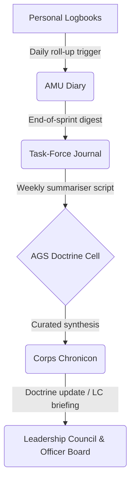

*Correction → A terser, more perspicuous formulation might have run thus:*  
> “Devise an *integrated journaling apparatus* for the Adaptive Command Matrix—specifying its strata, purposes, cadences, templates, and relational wiring—so that reflection, knowledge-harvesting, and cultural indoctrination become systematic rather than incidental.”

---

## Ⅰ / Why an ACM Journal Exists at All  

1. **Institutional Memory** – AMUs evaporate; their experiential residue must not.  
2. **Meritocratic Scrutiny** – A transparent log of thought-process and outcome is the crucible in which officer-quality is assayed.  
3. **Doctrinal Refinement** – Raw field notes, once aggregated, become the fertiliser of new doctrine.  
4. **Cultural Indoctrination** – Writing disciplines cognition; a shared stylebook of observation and candour embeds the ACM ethos.

---

## Ⅱ / Four Inter-locking Journals (Stratified Like Tree-Rings)  

| Stratum | Custodian | Cadence | Scope | Principal Questions |
|---------|-----------|---------|-------|---------------------|
| **A. Personal Logbook** | Every officer & specialist | Daily | Introspective; micro-decisions, experiments, emotional telemetry | “What did I attempt? What did I learn? What perplexes me?” |
| **B. AMU Mission Diary** | AMU Leader (O-0/O-1) | Sprintly | Tactical; progress, pivots, impediments | “Are we converging on KRs? Which hypotheses died?” |
| **C. Task-Force Field Journal** | Task-Force Commander (O-2) | Weekly | Operational; cross-AMU synergies, systemic blockers, process hacks | “Where is inertia? Where is serendipity?” |
| **D. Corps Journal (Chronicon)** | AGS Doctrine Cell | Monthly | Strategic; pattern synthesis, doctrine proposals, meta-metrics | “What recurring motifs demand codification or censure?” |

*Think of them as concentric rings: Personal feeds Mission; Mission feeds Field; Field is quarried by AGS into the Corps Chronicon.*

---

## Ⅲ / Canonical Template Snippets (Notion-Native)  

### 1. **Personal Logbook**  *(private, but shareable for mentoring)*  

```
Date ⟶ Relation to People_DB
AMU / Task-Force ⟶ Relation
Mood Index (1-5) ⟶ Select
Today I pursued …            (rich text, 3 bullet limit)
Unexpected observation …     (free paragraph)
Micro-metric snapshot …      (formula roll-up from Tasks)
Tomorrow I will …            (commitment line)
Oblique insight for Doctrine (checkbox → if true, signals AGS)
```

### 2. **AMU Mission Diary**  *(visible to LFO & AGS)*  

```
Sprint # / Dates
Delta vs KR graph  (linked chart)
Pivots / Scope Changes
Blockers Escalated
Customer Signal Nuggets
Retrospective “Stop / Start / Continue”
Artifact Links (PRs, decks, prototypes)
Next Sprint Objectives
```

### 3. **Task-Force Field Journal**  

```
Week X Summary
Cross-AMU Dependencies (roll-up)
Budget Burn Variance
Process Experiments Run (YES/NO + result)
Risks Re-rated
Talent Signal (promising officers, burnout flags)
Doctrine Suggestions (short prose)
```

### 4. **Corps Journal (Chronicon)**  

```
Volume 2025-04
Strategic Theme(s) Emerging
Doctrine Amendments Ratified
Patterns of Failure (top 3)
Patterns of Excellence (top 3)
Metric Zeitgeist (velocity, CAC, defect rate …)
Officer Promotions / Ejections
Edicts & Experiments for Next Volume
```

---

## Ⅳ / Workflow & Data Flow  



*Automate roll-ups via Notion API → scheduled scripts (Zapier/Make) converting check-box “Oblique insight” into tasks for Doctrine review.*

---

## Ⅴ / Permissions & Confidentiality  

| Artifact | Default Visibility | Redaction Rule |
|----------|-------------------|----------------|
| Personal Logbook | Author, Mentor-officer | Trauma or HR-sensitive lines ↦ black-box property |
| AMU Diary | AMU team, LFO, AGS | Client-confidential data redacted by AMU Lead |
| Field Journal | Task-Force, AGS, Command Leader | Pre-IPO financial metrics masked |
| Corps Chronicon | LC, Officer Corps, Shareholders (summary) | Trade-secret doctrine released only after 6-mo lag |

---

## Ⅵ / Meritocratic Leveraging  

1. **Officer Promotion Boards** consult Personal & AMU logs as evidence of *decision clarity* and *learning velocity.*  
2. **Up-or-Out Trigger**: two consecutive Corps volumes citing an officer’s chronic pattern of negligence → performance board.  
3. **Best-Entry Anthology**: annually the AGS publishes a curated “Best 50 Journal Excerpts” to institutionalise excellence and rhetorical style.  

---

## Ⅶ / Cultural Codex for Journaling  

1. **Brutal Candour, Zero Blame** – error is data, obfuscation is sin.  
2. **Brevity ≠ Triviality** – enforce page-limit; lucidity is rewarded.  
3. **Signal over Sentiment** – feelings logged only as they refine future action.  
4. **Doctrine Over Dogma** – every log is scanned for potential doctrinal mutation; nothing is sacrosanct.  

---

## Ⅷ / Implementation Sprint (14 days)  

| Day | Action | Tool  |
|-----|--------|-------|
| 1-3 | Clone journal DB templates, relate to People & AMU DBs | Notion |
| 4-6 | Write *Journaling Codex* page; LC decree | Notion |
| 7-9 | API Automations (daily roll-up, weekly summariser) | Make/Zapier + Notion API |
| 10-12 | Training micro-workshop (“Write Like a Commander”) | Loom / live |
| 13-14 | Dry-run: one AMU + one Task-Force simulate cycle; gather feedback | Notion comments |

---

### Finem  

A **journaling echelon** built natively into the ACM turns every officer into a **primary historian, experimenter, and teacher**; every AMU into a **case-study**; and the organisation into an **ever-refining organism** whose memory is not anecdotal but **queryable, auditable, and pedagogic**.

