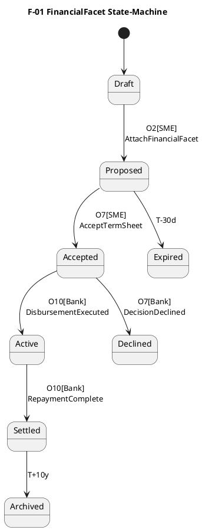

## 3 Opportunity-Facet Catalogue  
*Single ontology; every transactional instrument merely toggles facet presence.*

| UID | Facet | Mandatory? | Trigger to **Attach** | Payload — Core Fields (∆ → extensible) | Cardinal States (`Draft → … → Terminal`) | Retention Obligation |
|-----|-------|------------|----------------------|----------------------------------------|------------------------------------------|----------------------|
| **F-00** | **CoreHeader** | **Yes** | `O1 OpportunityCreated` | `opportunityId`, `actorRefs`, `instrumentType`, `createdAt` | Immutable (no state machine) | 10 y |
| **F-01** | **FinancialFacet** | Yes for **any** monetised instrument | `AttachFinancialFacet` command (SME) | `principal`, `currency`, `tenor`, `repaymentMode`, `version` | `Draft → Proposed → Accepted → Active → Settled` | 10 y post-settlement |
| **F-02** | **ImpactFacet** | Optional (green products) | Presence of taxonomy code in CoreHeader | `baselineMetric`, `projectedCO₂e`, `methodologyRef` | `Draft → Proposed → Verified → Locked` | 10 y |
| **F-03** | **VendorFacet** | Conditional | `AttachVendorFacet` (Vendor) | `vendorId`, `proposalHash`, `milestones[]` | `Draft → Committed → Completed` | 7 y |
| **F-04** | **VerificationFacet** | Optional | `O4 VerificationRequested` | `planHash`, `auditDate`, `reportHash`, `verifierSig` | `Planned → InProgress → Verified / Rejected` | 10 y |
| **F-05** | **CreditDecisionFacet** | Conditional | `O6 CreditDecisionRequested` | `riskGrade`, `greenScore`, `conditions[]` | `Draft → Approved / Declined → Expired` | 10 y |
| **F-06** | **IncentiveFacet** | Optional | Regulator eligibility pass | `subsidyType`, `payoutSchedule`, `guaranteePct` | `Pending → Granted → Revoked` | 10 y |
| **F-07** | **ComplianceFacet** | Auto-attached | `OpportunityCreated` | `kycRef`, `gdprFlags`, `auditLogPointer` | `Open → Archived` | 10 y |
| **F-08** | **DisbursementFacet** | Conditional | `CreditDecisionFacet=Approved` | `swiftRef`, `paymentDate`, `amount` | `Pending → Executed` | 10 y |

> **Catalogue Rule:** A new business product = new facet **or** new state in an existing facet—never a new standalone object. All facets reside under `opportunity/<id>/facets/` as JSON blobs version-keyed.

---

## 4 Design Doctrine for Facet State-Machines (“O-Star Diagrams”)  

### 4.1 Methodical Scaffold (Five-Step Forge)

1. **State Elicitation**  
 Examine the facet payload lifecycle; enumerate *minimal* discrete states.  
2. **Event Binding**  
 Map each state transition to an **O-code** from the Trigger Ledger; label arrow `O6[Bank]`.  
3. **Role Guard Affixing**  
 Verify that the actor in brackets has `Advance` power in Capability Matrix.  
4. **Timeout & Fallback Weaving**  
 For SLA-bound transitions, add dashed `T-Δ` edges to *Expired* or *Escalated*.  
5. **Sealing & Hashing Checkpoints**  
 Insert double-border states where the facet is cryptographically frozen; update Opportunity root hash upon entry.

### 4.2 Canonical State Lexicon  

| Symbol | Semantics |
|--------|-----------|
| **Draft** | Owner editable; schema-validated only on save |
| **Proposed** | Submitted for external evaluation |
| **Verified** | Third-party attestation passed |
| **Approved / Declined** | Decision authority outcome |
| **Active** | Financial obligations running |
| **Settled** | All monetary duties fulfilled |
| **Locked** | Immutable for historical reference |
| **Expired / Revoked** | Lapsed due to timeout or breach |
| **Archived** | Past retention policy; read-only cold storage |

### 4.3 Exemplar: **FinancialFacet (F-01)** in PlantUML  

*Store as `/statecharts/F-01_FinancialFacet.puml`; pipeline linter ensures O-codes and actor tags resolve.*

### 4.4 Toolchain Mandate  

| Activity | Tool | Enforcement Hook |
|----------|------|------------------|
| Diagram authoring | PlantUML or Mermaid text files | Git pre-commit linter→reject orphan O-codes |
| Validation | JSON Schema per facet | CI step: Ajv validate sample payloads |
| Event replay tests | ksqlDB + Cucumber | CI step after merge |

### 4.5 Governance Coupling  

*Governance & Transition Table* (#7) will ingest the `.puml` sources, parse transitions, and generate a CSV of `(Facet, FromState, Event, ToState, Actor, SLA)` — ensuring legal, engineering, and audit teams read the same truth.

---

### Action Directive  

1. **Draft JSON Schema** for `F-00` to `F-02` **today**.  
2. **Forge state-machines** for the same facets and commit `.puml`.  
3. **Run linter**; fix any capability or O-code mismatch.  

The Opportunity paradigm now has its skeletal ontology (catalogue) and muscle (state-machines). Execute.