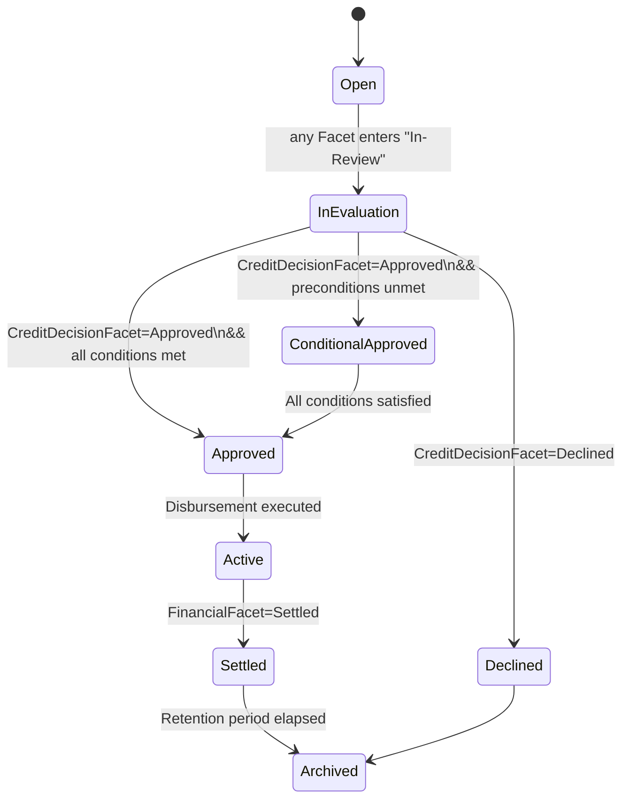

### Executive Thesis  
Re-architect your platform around a single **Opportunity** aggregate that accretes information through event-driven faceting. This construct subsumes “loan”, “grant”, “lease”, or any yet-unknown instrument; each merely toggles or adds *facets* on the same canonical root. The pay-off: one ontology, infinite instrument flexibility, zero cross-object synchronisation drift.

---

## I Structural Anatomy — Opportunity Aggregate

| Facet (Pluggable Module) | Mandatory? | Instantiation Trigger | Payload Essence | Termination State |
|--------------------------|------------|----------------------|-----------------|-------------------|
| **Core Header** | Yes | E0 onboarding + E1 intent | UID, actor references, instrument type enum, creation timestamp | Never (immutable) |
| **FinancialFacet** | Yes for any monetised instrument | E1 intent | Principal, currency, tenor, repayment modality | `Settled` |
| **ImpactFacet** | Optional | Template-driven by taxonomy code in E1 | Baseline metric, projected CO₂-e delta | `Verified` |
| **VendorFacet** | Conditional | Presence of A-02 Vendor Proposal | Vendor ID, proposal hash, milestone schedule | `Completed` |
| **VerificationFacet** | Optional | E3 dossier complete | Audit plan, report hash, verifier signature | `Verified` or `Rejected` |
| **CreditDecisionFacet** | Conditional | E6 decision request | Risk grade, green score, conditionality list | `Approved`, `Declined`, `Expired` |
| **IncentiveFacet** | Optional | Regulator schema indicates eligible | Subsidy type, payout schedule, guarantee coverage | `Granted`, `Revoked` |
| **ComplianceFacet** | Auto-attached | On Opportunity creation | AML/KYC references, GDPR flags, audit log pointer | `Archived` after retention expiry |

> **Facets are independent JSON sub-documents** referenced in the root by `facetId`. Absence == not applicable; presence + state == semantic signal.

---

## II Progressive Elaboration Mechanism  

1. **Event-Sourced Population**  
   *Opportunity* evolves via immutable events (`OpportunityFaceted`, `FacetUpdated`, `FacetStateChanged`). The current snapshot is a materialised view.

2. **Facet Contract**  
   Each facet adheres to:  
   ```typescript
   interface Facet<TState extends string> {
       id: UUID
       name: string
       state: TState
       payload: Record<string, any>
       version: int
       createdAt: Instant
       updatedAt: Instant
   }
   ```

3. **Command Validation Layer**  
   Commands (`AttachFacet`, `ChangeFacetState`, `UpdatePayload`) route through policy checks: actor capability, trigger legitimacy, schema validation.

4. **Inter-Facet Orchestration**  
   *Saga* or *Process Manager* subscribes to events; e.g. `VerificationFacet.Verified` emits `CreditDecisionFacet.Activate`.

---

## III Opportunity State-Machine (Macro Level)  



*All micro-facet state-machines nest under these macro states to guarantee systemic determinism.*

---

## IV Governance & Versioning

* **Schema Contracting** — JSON Schema per facet, version-keyed; breaking change => new facet version, never mutation.  
* **Cryptographic Integrity** — Root object stores Merkle root of all facet hashes; any facet update re-seals root.  
* **Access Control** — RBAC at facet granularity (`canRead`, `canWrite`, `canAdvanceState`).  
* **Temporal Cohesion** — Each facet event carries `effectiveFrom`; time-travel queries reconstruct historical snapshots for audit.

---

## V Implementation Blueprint

| Layer | Technology | Rationale |
|-------|------------|-----------|
| **Event Store** | Apache Kafka w/ topic per Opportunity | Append-only, replayable, horizontally scalable |
| **Materialised Views** | Postgres JSONB view per Opportunity | Low-latency query, ACID when needed |
| **Schema Validation** | JSON Schema + Ajv (Node) or Zod (TS) | Runtime & build-time enforcement |
| **Diagram-as-Code** | PlantUML/Mermaid in `/domain/opportunity` | Guaranteed synchrony with code |
| **API Surface** | GraphQL (`Opportunity` type resolves facets) | Allows sparse retrieval; schema stitching for new facets |
| **Analytics / KPI** | Grafana over ksqlDB streams | Real-time compliance & incentive dashboards |

---

## VI Trade-offs & Risk Surface

| Dimension | Benefit | Risk | Mitigation |
|-----------|---------|------|------------|
| **Single Aggregate** | Zero cross-object sync errors | Object bloat; high contention | Shard by Opportunity UID; facet-level lazy loading |
| **Event Sourcing** | Auditable history; rollback | Steeper learning curve | Provide “snapshot” API to consumers; internal replay only |
| **Facet Plugin Model** | Instrument-agnostic extensibility | Convoluted ACL matrix | Encode ACL rules in **Actor Capability Matrix**; automate tests |
| **GraphQL Interface** | Client-chosen granularity | N+1 query hell | DataLoader pattern; persisted queries |

---

### Tactical Orders

1. **Draft JSON Schema** for *Core*, *Financial*, *Verification* facets **today** — they unblock PoC.  
2. **Spin Kafka Cluster** (single-node dev) and publish *AttachFacet* events from onboarding flow.  
3. **Generate UML** for Opportunity macro-machine and glue into architecture repo.  
4. **Refactor Artifact Catalogue** — map each previous UID to its corresponding facet or attachment field; retire stand-alone artefacts once migration complete.  

Adopt the Opportunity aggregate and you convert disparate, brittle artefacts into a coherent, self-auditing knowledge object—fit for loans today, power-purchase agreements tomorrow, and whatever incentive instrument Berlin or Brussels concocts next year.